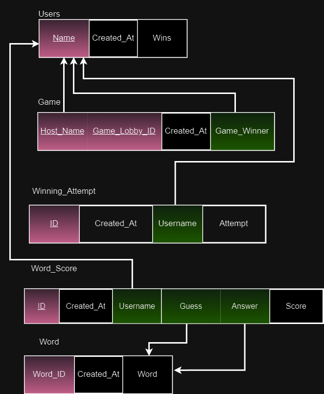
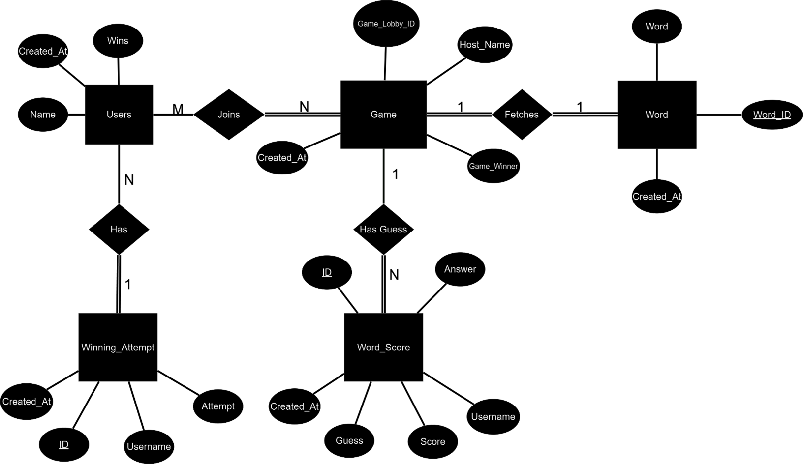
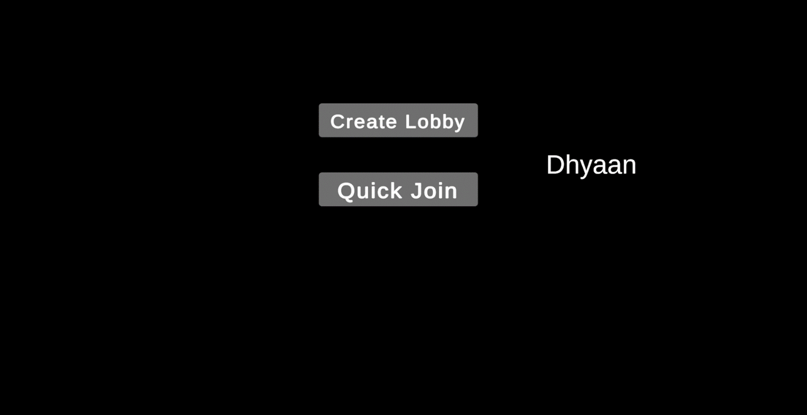
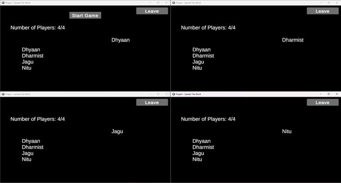
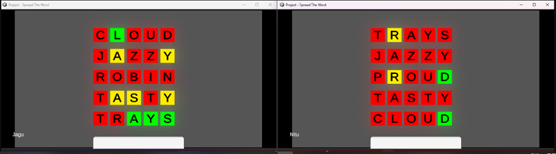
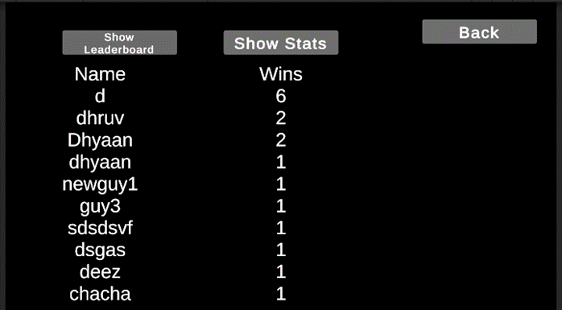
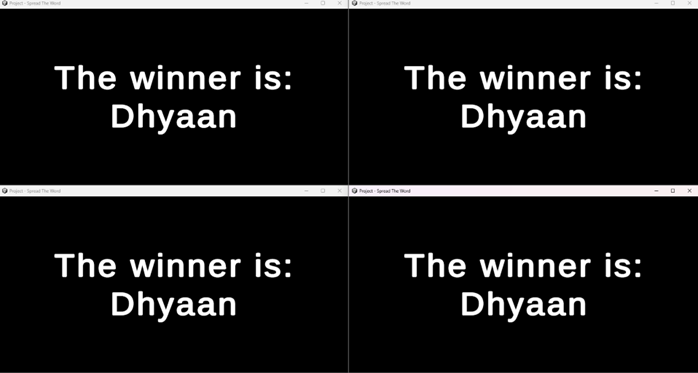

# Spread the Word 🎮

**Spread the Word** is an exciting multiplayer online word-guessing game platform built with Unity, powered by Supabase. Players can engage in fun, competitive word-guessing games similar to Wordle, improve their vocabulary, and enjoy a real-time multiplayer experience with friends or random players across the globe.

## Key Features 🔑

- **Quick Sign-In**: Enjoy anonymous quick sign-in, allowing you to jump straight into the game.
- **Lobbies**: Host or join game lobbies supporting up to 4 players for competitive real-time gameplay.
- **Real-Time Multiplayer**: Synchronized gameplay experiences across all participants with seamless networking.
- **Leaderboards**: Track scores and compare performance against others.
- **Data Management**: Uses **Supabase** to manage player data, game sessions, and real-time interactions.

---

## Technology Stack 🛠️

- **C# and .NET**: Backend logic for game operations.
- **Unity 3D Engine**: Game development and multiplayer functionalities.
- **Supabase (PostgreSQL)**: Manages real-time database interactions, storing player data, game sessions, and scores.
- **Unity Netcode**: Ensures real-time multiplayer connections and synchronization of game states.
- **Unity Lobby and Relay**: Manages multiplayer session hosting, player synchronization, and networking.
- **Supabase Auth**: Provides easy and anonymous authentication for players.

---

## Database Schema 🗄️

The database schema for **Spread the Word** showcases how users, games, scores, and word entities are structured and interrelated:



### Key Entities:

- **Users**:

  - Stores player information such as username and gameplay statistics.
  - Includes total games played, games won, and other performance metrics.

- **Game**:

  - Records each game session with a unique game ID.
  - Tracks details like the start and end time, players involved, and game status.

- **Word**:

  - Contains the list of words used in the game.
  - Each entry includes the word, difficulty level, and language, ensuring diversity in gameplay.

- **Word_Score**:

  - Stores the scores achieved by players for each word guessed during a game.
  - Tracks the player's username, the guessed word, and the score associated with that guess.

- **Winning_Attempt**:
  - Records the winning attempts made by players in a game.
  - Stores the player's username, the word they guessed, and the timestamp of the winning attempt.

---

## ER Diagram 📊

The ER Diagram provides insights into the relationships between various entities in the database:



---

## Game Screenshots 📷

Here are some visuals of the game in action:

1. **Login Screen**

   

2. **Lobby Screen**

The lobby screen is where players can host or join game lobbies for competitive real-time gameplay. Up to 4 players can join a lobby and engage in exciting word-guessing games. The lobby screen provides a seamless networking experience, allowing players to connect with friends or random players from across the globe.

To host a game lobby, simply select the "Host Game" option and wait for other players to join. Alternatively, you can join an existing lobby by selecting the "Join Game" option and entering the lobby code provided by the host.

Once the lobby is full or all players are ready, the game will start and players can begin guessing words and competing for the highest score. The lobby screen also displays the usernames of all players in the lobby, making it easy to keep track of who you're playing with.

Enjoy the competitive multiplayer experience of Spread the Word in the lobby screen and have fun improving your vocabulary while challenging your friends or other players worldwide.




3. **Gameplay**

The gameplay screenshot showcases two players engaged in an intense word-guessing session of Wordle. Each player must strategically guess the correct word within a limited number of attempts. The objective is to be the first player to correctly guess the word and secure victory.

As shown in the screenshot, both players have their screens filled with letters and a text input field where they can enter their guesses. The game provides feedback on each guess, indicating which letters are correct and in the correct position, and which letters are correct but in the wrong position. Players can use this feedback to refine their subsequent guesses and increase their chances of winning.

The gameplay of Wordle is fast-paced and highly competitive, requiring players to think quickly and strategically to outsmart their opponents. With its engaging mechanics and challenging word puzzles, Wordle offers an exciting and addictive multiplayer experience for players of all skill levels.



4. **Leaderboard**

The leaderboard screenshot showcases the ranking of players based on their number of wins in the game. Players are listed in descending order, with the player having the highest number of wins at the top. The leaderboard provides a competitive element to the game, allowing players to track their progress and compare their performance against others. It serves as a motivation for players to improve their skills and strive to reach the top of the leaderboard.


5. **Winner Across Lobby**

The "Winner Across Lobby" screenshot showcases the moment when a player successfully guesses their word first and is declared the winner of the game. In this scenario, regardless of whether the other players have guessed their words or not, the screen displays the name of the person who guessed the word first. This is achieved by sending a message to the server/host, informing them that there is a winner for the game. Subsequent win messages will not change the winner, ensuring a fair and conclusive outcome. The "Winner Across Lobby" screen celebrates the victorious player and highlights their achievement in the multiplayer word-guessing game.

## 

## Setup Instructions ⚙️

1. **Clone the repository**:

   ```bash
   git clone https://github.com/Dhyaan1/Spread-The-Word.git
   ```

2. **Unity Setup**:

   - Open the project in Unity.
   - Install necessary Unity Netcode and Supabase plugins.

3. **Supabase Configuration**:

   - Set up a new project in Supabase.
   - Update your Supabase URLs and keys in the project settings.

4. **Run the Game**:
   - Build and run the project through the Unity Editor.
   - Start playing and enjoying seamless multiplayer word games with friends.

---

## Future Plans 🚀

- **Social Features**: Introduce chat, friends lists, and player profiles.
- **New Game Modes**: Develop new challenging modes and gameplay variations.
- **Mobile Support**: Extend compatibility to mobile platforms for gaming on the go.
- **Dynamic Content**: Regular updates to word lists and leaderboards to keep gameplay fresh and exciting.

---

## Contributions 🤝

We welcome contributions from the community! If you'd like to contribute:

1. Fork the repository.
2. Create a new branch with your feature or improvement.
3. Submit a pull request for review.

---
